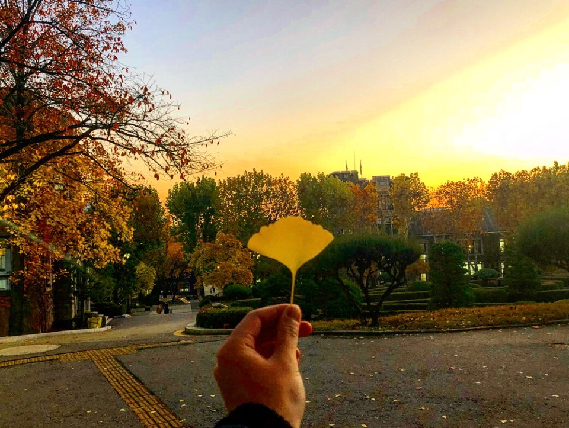

# 제목
## 소제목
안녕하세요

* 목록
    * 이런
    1. 우와 신기
* 헐

1. 순서가
2. 필요한
3. 목록

* *강조* 
* **강조** 
* 강조


테이블 | 만들기
----- | -----
A | B
내용 | 내용
헐 | 신기

[링크] (www.facebook.com)


> 인용

```python
def foo():
    if not bar:
        return True
``` 



[^!] 각주